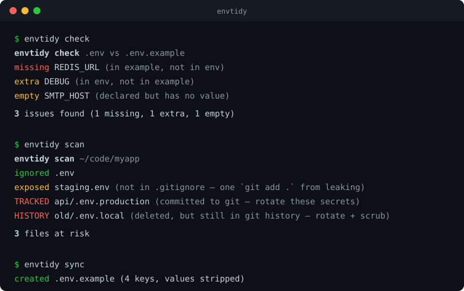

# envtidy

> Keep your `.env` files honest — catch drift, sync examples, find leaks.


Every team has lived this bug: someone adds `REDIS_URL` to their local `.env`, forgets to update `.env.example`, and the next person to clone the repo burns an hour debugging a crash that was really just a missing variable. Or worse — someone's `staging.env` was never gitignored and ships to GitHub with live credentials inside.

**envtidy** is a tiny CLI that catches both. Pure Python stdlib, zero dependencies, single-purpose.



## Install

```bash
pipx install git+https://github.com/nidhisebastian008/envtidy
# or
pip install git+https://github.com/nidhisebastian008/envtidy
```

## Usage

### `envtidy check` — catch drift

Compares `.env` against `.env.example` (also auto-detects `.sample`, `.template`, `.dist`):

```
$ envtidy check
envtidy check  .env vs .env.example
  missing  REDIS_URL  (in example, not in env)
  extra    DEBUG  (in env, not in example)
  empty    SMTP_HOST  (declared but has no value)

3 issues found (1 missing, 1 extra, 1 empty)
```

Exits `1` when drift is found, `0` when clean — drop it straight into CI or a pre-commit hook:

```yaml
# .pre-commit-config.yaml
- repo: local
  hooks:
    - id: envtidy
      name: envtidy check
      entry: envtidy check
      language: system
      pass_filenames: false
```

### `envtidy sync` — regenerate the example file

Rewrites `.env.example` from your real `.env`, stripping every value but preserving comments, blank lines, and key order:

```
$ envtidy sync
created .env.example (4 keys, values stripped)
```

Use `--dry-run` to preview without writing.

### `envtidy scan` — find files that leaked (or are about to)

Walks a directory tree, finds every env file, and checks each one against git — **including the full git history**. Deleting a committed `.env` doesn't remove it; anyone with a clone can still recover it. `scan` catches that:

```
$ envtidy scan
envtidy scan  ~/code/myapp
  ignored  .env
  exposed  staging.env  (not in .gitignore — one `git add .` from leaking)
  TRACKED  api/.env.production  (committed to git — rotate these secrets)
  HISTORY  old/.env.local  (deleted, but still in git history — rotate + scrub)

3 files at risk
hint: scrub history with `git filter-repo --sensitive-data-removal --invert-paths --path <file>`
```

- **ignored** — safely gitignored, never committed ✅
- **exposed** — exists but *not* gitignored; one `git add .` away from a leak
- **TRACKED** — committed right now; treat those secrets as compromised and rotate them
- **HISTORY** — not in the working tree or index anymore, but recoverable from git history; rotate the secrets *and* scrub the history

## Alternatives

Prior art exists — pick the right tool for your job:

- [dotenv-linter](https://github.com/dotenv-linter/dotenv-linter) — fast Rust linter for `.env` *style* (duplicate keys, ordering, quoting), with a `compare` command for key diffs. No git awareness, no example generation.
- [sync-dotenv](https://github.com/luqmanoop/sync-dotenv) — Node tool doing what `envtidy sync` does.
- [gitleaks](https://github.com/gitleaks/gitleaks) / trufflehog / detect-secrets — heavyweight *content-level* secret scanners with rules and entropy checks. Use them for full audits; use `envtidy scan` for the quick file-level answer to "are my env files safe in this repo?"

envtidy's niche: all three jobs (drift check, example sync, git-aware leak scan) in one zero-dependency CLI with no config.

## Details

- Understands `export KEY=value`, quoted values, inline `# comments`
- Respects [`NO_COLOR`](https://no-color.org/); colors auto-disable when piped
- Skips `node_modules`, `.venv`, `.git`, build dirs while scanning
- Exit codes: `0` clean · `1` issues found · `2` usage error

## License

MIT
